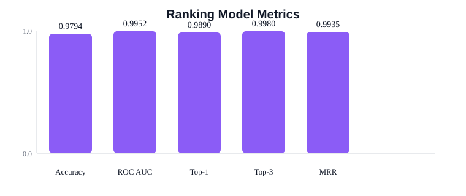

# Ranking Model Results

This report summarizes the Logistic Regression candidate-ranking model.

## Training Data Summary

| Item | Value |
|---|---:|
| Training candidates | 60,544 |
| Manual candidates | 416 |
| Selection history candidates | 4,716 |
| Word-pair context candidates | 5,415 |
| Positive candidates | 5,121 |
| Negative candidates | 55,423 |
| Train candidates | 48,435 |
| Test candidates | 12,109 |

## Performance Metrics

| Metric | Value |
|---|---:|
| Accuracy | 0.9794 |
| ROC AUC | 0.9952 |
| Top-1 Accuracy | 0.9890 |
| Top-3 Accuracy | 0.9980 |
| Mean Reciprocal Rank | 0.9935 |

## Classification Report

| Class | Precision | Recall | F1-score | Support |
|---|---:|---:|---:|---:|
| Incorrect candidate (0) | 0.9973 | 0.9802 | 0.9887 | 11,085 |
| Correct candidate (1) | 0.8189 | 0.9717 | 0.8888 | 1,024 |
| Weighted average | 0.9823 | 0.9794 | 0.9802 | 12,109 |

## Figure

